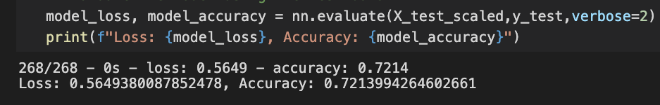
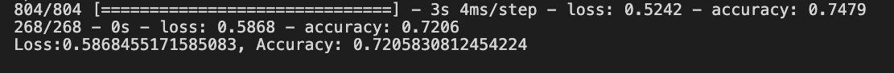
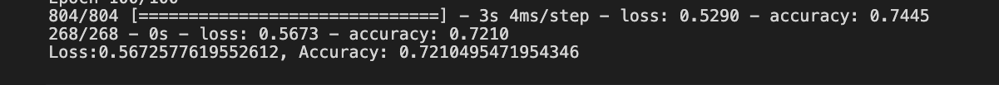

# Nueral_Network_Charity_Analysis

Run a deep learning model to predict whether an applicant will be succesful if funded by Alphabet Soup.  We will use dataset of organizations that have been funded by Alphabet Soup over the years.

# Deep learning (nueral networks) steps to analyze our dataset.

- Import dependencies.
- Import the input dataset.
- Generate categorical variable list.
- Create a OneHotEncoder instance.
- Fit and transform the OneHotEncoder.
- Add the encoded variable names to the DataFrame.
- Merge one-hot encoded features and drop the originals.
- Split the preprocessed data into features and target arrays.
- Split the preprocessed data into training and testing dataset.
- Create a StandardScaler instance.
- Fit the StandardScaler.
- Scale the data.
- Define the model.
- Add first and second hidden layers.
- Add the output layer.
- Check the structure of the model.

- **Data Preprocessing**
I removed the EIN and NAME columns along with ORGANIZATION_Trust, USE_CASE_Other,USE_CASE_Heathcare, AFFILIATION_Other to analyze if removing certain columns would optimize accuracy rate.  I left all other columns as my variables and my dependant variable as IS_Succesful.

- **Compiling, Training, and Evaluating the Model**
  **1st Attempt**
   - 2 Hidden Layers
   - 60 neurons (Layer1), 20 neurons(Layer2)
   - Used Relu and Sigmoid Activations Functions 
   
   
  **2nd Attempt**
   - 3 Hidden Layers 
   - 60 neurons (Layer1), 20 neurons(Layer2), 10 neurons
   - Used Relu and Sigmoid Activations Functions 
    

   **3rd Attempt**
  - 3 Hidden Layers
  - 60 neurons (Layer1), 20 neurons(Layer2), 10 neurons
  - Reordered Relu and Sigmoid Activations 
   

## Summary
Several attempts to optimize the models resulted in an average of 72% accuracy. In order to achieve more than 75% accuracy would take several attempts through trial and error.  I would analyze the density of the data and remove any outliers in order to reach the goal of 75% accuracy.

